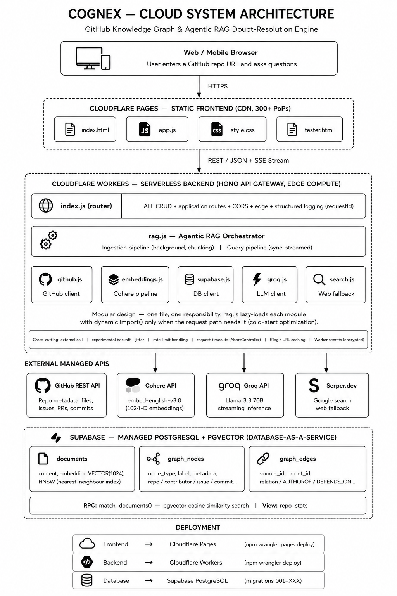

# 🧠 Cognex — Knowledge Graph & Doubt Resolution Engine

> **Deployed App:** [https://cognex-5ij.pages.dev/](https://cognex-5ij.pages.dev/)  
> **Repository:** [https://github.com/ParthanahalliRehaan/3_Cognex](https://github.com/ParthanahalliRehaan/3_Cognex)  
> **License:** MIT  
> **Version:** 1.2.0

---

## 📌 Problem Statement

Developers and students spend hours trying to understand unfamiliar GitHub repositories. Reading READMEs, browsing file trees, and tracing dependencies is time-consuming and error-prone. **Cognex** solves this by automatically extracting a repository's metadata, building a structured **Knowledge Graph**, and answering natural-language questions using **Agentic RAG** (Retrieval-Augmented Generation). Users simply paste a GitHub URL and ask questions like *"How does the auth system work?"* or *"Who are the top contributors?"*

---

## 🏗️ System Architecture



### Architecture Layers

| Layer | Technology | Cloud Service | Purpose |
|-------|-----------|---------------|---------|
| **Client** | HTML5 / CSS3 / JavaScript | Browser / Mobile | User interface |
| **Frontend** | Static site + Cytoscape.js | **Cloudflare Pages** | Graph visualization, chat UI |
| **Backend** | Hono (Node.js) | **Cloudflare Workers** | RESTful API, RAG orchestration |
| **Database** | PostgreSQL + pgvector | **Supabase** | Graph storage, vector search |
| **Embeddings** | Cohere `embed-english-v3.0` | **Cohere API** | 1024-D text embeddings |
| **LLM** | Llama 3.3 70B | **Groq API** | Streaming answer generation |
| **Search** | Google Search | **Serper.dev** | Web fallback for missing context |
| **Data Source** | GitHub REST API | **GitHub** | Repository metadata, code, issues |

### Data Flow

1. **Ingestion Flow:**
   ```
   User → POST /api/ingest → GitHub API (fetch repo data)
                        → Graph Builder (nodes + edges)
                        → Embedding Pipeline (Cohere API)
                        → Supabase (store graph + vectors)
   ```

2. **Query Flow:**
   ```
   User → POST /api/ask → Embed query (Cohere)
                     → Vector search (pgvector)
                     → Graph retrieval (Supabase)
                     → [Optional] Web search (Serper)
                     → LLM prompt assembly (Groq)
                     → Streaming response
   ```

---

## 🗄️ Database Design

### Schema Overview

The database runs on **Supabase PostgreSQL** with the `pgvector` extension enabled for high-dimensional vector similarity search.

### Tables

#### `documents` — Vector Search Store

| Column | Type | Constraints | Description |
|--------|------|-------------|-------------|
| `id` | `UUID` | `PRIMARY KEY DEFAULT gen_random_uuid()` | Unique document ID |
| `repo_url` | `TEXT` | `NOT NULL` | Source repository URL |
| `content` | `TEXT` | `NOT NULL` | Raw text chunk (code, README, issue) |
| `metadata` | `JSONB` | `DEFAULT '{}'` | Source type, path, chunk index |
| `embedding` | `VECTOR(1024)` | — | 1024-D embedding from Cohere |

**Indexes:**
- `idx_documents_repo` — B-tree on `repo_url`
- `idx_documents_metadata` — GIN on `metadata`
- `idx_documents_embedding_hnsw` — HNSW index for fast cosine similarity

#### `graph_nodes` — Knowledge Graph Entities

| Column | Type | Constraints | Description |
|--------|------|-------------|-------------|
| `id` | `UUID` | `PRIMARY KEY DEFAULT gen_random_uuid()` | Unique node ID |
| `repo_url` | `TEXT` | `NOT NULL` | Source repository URL |
| `node_type` | `TEXT` | `NOT NULL` | `file`, `function`, `contributor`, `issue`, `pr`, `commit`, `dependency`, `repo`, `readme` |
| `label` | `TEXT` | `NOT NULL` | Human-readable name |
| `metadata` | `JSONB` | `DEFAULT '{}'` | Extended properties |

**Indexes:**
- `idx_graph_nodes_repo` — B-tree on `repo_url`
- `idx_graph_nodes_type` — B-tree on `node_type`
- `idx_graph_nodes_label` — B-tree on `label`
- `idx_graph_nodes_repo_type` — Composite on `(repo_url, node_type)`

#### `graph_edges` — Knowledge Graph Relationships

| Column | Type | Constraints | Description |
|--------|------|-------------|-------------|
| `id` | `UUID` | `PRIMARY KEY DEFAULT gen_random_uuid()` | Unique edge ID |
| `repo_url` | `TEXT` | `NOT NULL` | Source repository URL |
| `source_node_id` | `UUID` | `REFERENCES graph_nodes(id) ON DELETE CASCADE` | Origin node |
| `target_node_id` | `UUID` | `REFERENCES graph_nodes(id) ON DELETE CASCADE` | Target node |
| `relation` | `TEXT` | `NOT NULL` | `CONTAINS`, `AUTHORED`, `MODIFIES`, `REFERENCES`, `FIXES`, `DEPENDS_ON`, `IMPORTS`, `OPENED` |
| `metadata` | `JSONB` | `DEFAULT '{}'` | Extended properties |

**Indexes:**
- `idx_graph_edges_repo` — B-tree on `repo_url`
- `idx_graph_edges_source` — B-tree on `source_node_id`
- `idx_graph_edges_target` — B-tree on `target_node_id`
- `idx_graph_edges_relation` — B-tree on `relation`
- `idx_graph_edges_repo_relation` — Composite on `(repo_url, relation)`
- `idx_graph_edges_metadata` — GIN on `metadata`

### RPC Functions

#### `match_documents(query_embedding, match_threshold, match_count, filter_repo_url)`

Performs cosine similarity search over the `documents` table using pgvector's `<=>` operator.

```sql
CREATE OR REPLACE FUNCTION match_documents(
  query_embedding VECTOR(1024),
  match_threshold FLOAT DEFAULT 0.5,
  match_count INT DEFAULT 10,
  filter_repo_url TEXT DEFAULT NULL
)
RETURNS TABLE (id UUID, repo_url TEXT, content TEXT, metadata JSONB, similarity FLOAT)
LANGUAGE SQL STABLE
AS $$
  SELECT
    d.id, d.repo_url, d.content, d.metadata,
    1 - (d.embedding <=> query_embedding) AS similarity
  FROM documents d
  WHERE
    (filter_repo_url IS NULL OR d.repo_url = filter_repo_url)
    AND 1 - (d.embedding <=> query_embedding) > match_threshold
  ORDER BY d.embedding <=> query_embedding
  LIMIT match_count;
$$;
```

### Views

#### `repo_stats`

Aggregates node count, edge count, document count, and last ingestion time per repository.

---

## 🔌 RESTful API

Cognex exposes a complete **CRUD** REST API over three core resources: **Graph Nodes**, **Graph Edges**, and **Documents**.

### CRUD Endpoints Summary

| Resource | Create | Read (List) | Read (One) | Update | Delete |
|----------|--------|-------------|------------|--------|--------|
| **Graph Nodes** | `POST /api/nodes` | `GET /api/nodes?repoUrl=...` | `GET /api/nodes/:id` | `PUT /api/nodes/:id` | `DELETE /api/nodes/:id` |
| **Graph Edges** | `POST /api/edges` | `GET /api/edges?repoUrl=...` | `GET /api/edges/:id` | `PUT /api/edges/:id` | `DELETE /api/edges/:id` |
| **Documents** | `POST /api/documents` | `GET /api/documents?repoUrl=...` | `GET /api/documents/:id` | `PUT /api/documents/:id` | `DELETE /api/documents/:id` |

### Application Endpoints

| Endpoint | Method | Description |
|----------|--------|-------------|
| `/health` | `GET` | Service health + dependency status |
| `/api/ingest` | `POST` | Trigger repository ingestion (background) |
| `/api/ask` | `POST` | Ask a question → streaming LLM answer |
| `/api/graph` | `GET` | Retrieve full knowledge graph |
| `/api/status` | `GET` | Check ingestion progress |
| `/api/stats` | `GET` | Repository analytics |

> **Full API documentation:** See [`API_DOCUMENTATION.md`](API_DOCUMENTATION.md)

---

## ☁️ Cloud Services & Components

### 1. Cloudflare Pages (Frontend)
- **Service Type:** Static site hosting + CDN
- **Why chosen:** Zero-config global CDN, free tier, instant deploys from git
- **Deployment:** `npx wrangler pages deploy ./frontend`
- **URL:** `https://cognex-5ij.pages.dev/`

### 2. Cloudflare Workers (Backend)
- **Service Type:** Serverless compute at the edge
- **Why chosen:** Sub-50ms cold starts, 300+ global PoPs, generous free tier (100k req/day)
- **Framework:** Hono (lightweight, Express-like router for Workers)
- **Deployment:** `npm run deploy` via Wrangler CLI
- **Key features:**
  - `ctx.waitUntil()` for background ingestion (bypasses 50ms CPU limit)
  - Lazy module loading to reduce cold-start time
  - CORS handled at edge layer
  - Structured logging with request IDs

### 3. Supabase (Database)
- **Service Type:** Managed PostgreSQL + REST API + Realtime
- **Why chosen:** Free tier includes 500MB DB, built-in pgvector extension, row-level security
- **Schema:** 3 tables + 1 RPC function + 1 view + 10+ indexes
- **Connection:** `@supabase/supabase-js` client with session disabled (Worker-safe)

### 4. Cohere API (Embeddings)
- **Service Type:** Managed embedding inference
- **Model:** `embed-english-v3.0` (1024 dimensions)
- **Why chosen:** Free tier available, high-quality retrieval embeddings, supports `search_document` vs `search_query` input types
- **Optimization:** LRU cache, batch processing (max 96 per call), exponential backoff

### 5. Groq API (LLM)
- **Service Type:** Ultra-fast LLM inference
- **Model:** `llama-3.3-70b-versatile` (primary) with fallback chain
- **Why chosen:** Fastest inference in market, free tier, streaming support via Vercel AI SDK
- **Optimization:** Token budget enforcement, context trimming, model fallback chain, timeout handling

### 6. Serper.dev (Web Search)
- **Service Type:** Google Search API
- **Why chosen:** 2,500 free queries, structured JSON results, no scraping needed
- **Usage:** Fallback when vector search returns insufficient context

### 7. GitHub REST API
- **Service Type:** Repository data source
- **Authentication:** Personal Access Token (PAT) with `repo` scope
- **Rate limit:** 5,000 requests/hour (authenticated)
- **Optimization:** ETag caching, exponential backoff, concurrency-limited batch fetching

---

## 📁 Project Structure

```
3_Cognex/
├── frontend/                          # Cloudflare Pages site
│   ├── index.html                     # Main UI: repo input + chat + graph
│   ├── app.js                         # Frontend logic: API calls, graph render, SSE stream
│   ├── style.css                      # Dark-mode responsive styles
│   └── tester.html                    # API testing interface
│
├── backend/                           # Cloudflare Worker
│   └── cognex-worker/
│       ├── src/
│       │   ├── index.js               # Hono router — ALL CRUD + app routes
│       │   ├── github.js              # GitHub REST API client (fetch, retry, cache)
│       │   ├── graph.js               # Knowledge graph builder (nodes + edges)
│       │   ├── embeddings.js          # Cohere embedding pipeline (chunk, batch, cache)
│       │   ├── supabase.js            # Supabase client + CRUD wrappers + retry logic
│       │   ├── rag.js                 # Agentic RAG orchestrator (ingest + query)
│       │   ├── groq.js                # Groq LLM client (streaming + fallback)
│       │   └── search.js              # Serper.dev web search (cache + dedup)
│       ├── wrangler.jsonc             # Cloudflare Worker config
│       ├── package.json               # Dependencies
│       └── test/                      # Unit tests (Vitest)
│
├── supabase/
│   └── migrations/
│       ├── 001_init.sql               # Initial schema: tables, pgvector, match_documents()
│       ├── 002_migration.sql          # Add metadata to edges + indexes
│       └── 003_Bridge-Migration.sql   # HNSW index, performance indexes, repo_stats view
│
├── Others/
│   ├── Docs/                          # Internal development notes
│   ├── Errors/                        # Error logs & debugging notes
│   └── Instructions.md                # Original build guide
│
├── API_DOCUMENTATION.md               # Complete REST API reference
├── cognex-architecture-diagram.png    # Visual system architecture
├── README.md                          # This file
└── LICENSE.md                         # MIT License
```

---

## 🚀 Deployment Guide

### Prerequisites
- Node.js 20+
- Cloudflare account (free)
- Supabase account (free)
- Groq API key (free tier)
- Cohere API key (free tier)
- GitHub Personal Access Token
- Serper.dev API key (free tier)

### 1. Deploy Database (Supabase)

```bash
# Create a new Supabase project at https://supabase.com
# Go to SQL Editor → New query
# Run migrations in order:
#   1. supabase/migrations/001_init.sql
#   2. supabase/migrations/002_migration.sql
#   3. supabase/migrations/003_Bridge-Migration.sql
```

Grab your **Project URL** and **Service Role Key** from Project Settings → API.

### 2. Deploy Backend (Cloudflare Workers)

```bash
cd backend/cognex-worker

# Install dependencies
npm install

# Set secrets
npx wrangler secret put SUPABASE_URL
npx wrangler secret put SUPABASE_SERVICE_KEY
npx wrangler secret put SUPABASE_ANON_KEY
npx wrangler secret put GROQ_API_KEY
npx wrangler secret put GITHUB_TOKEN
npx wrangler secret put COHERE_API_KEY
npx wrangler secret put WEB_SEARCH_API_KEY

# Deploy
npm run deploy
```

### 3. Deploy Frontend (Cloudflare Pages)

```bash
cd frontend

# Deploy static assets
npx wrangler pages deploy .
```

Update `app.js` to point to your deployed Worker URL.

---

## 🧪 Testing

### Health Check
```bash
curl https://cognex-worker.your-subdomain.workers.dev/health
```

### Ingest a Repository
```bash
curl -X POST https://cognex-worker.your-subdomain.workers.dev/api/ingest \
  -H "Content-Type: application/json" \
  -d '{"repoUrl": "https://github.com/facebook/react"}'
```

### Ask a Question
```bash
curl -X POST https://cognex-worker.your-subdomain.workers.dev/api/ask \
  -H "Content-Type: application/json" \
  -d '{"repoUrl": "https://github.com/facebook/react", "query": "How does useEffect work?"}'
```

### CRUD — Create a Node
```bash
curl -X POST https://cognex-worker.your-subdomain.workers.dev/api/nodes \
  -H "Content-Type: application/json" \
  -d '{
    "repo_url": "https://github.com/owner/repo",
    "node_type": "file",
    "label": "src/utils.ts",
    "metadata": {"extension": "ts"}
  }'
```

### CRUD — Update a Node
```bash
curl -X PUT https://cognex-worker.your-subdomain.workers.dev/api/nodes/<UUID> \
  -H "Content-Type: application/json" \
  -d '{"label": "src/utils/helpers.ts", "metadata": {"extension": "ts", "size": 1200}}'
```

### CRUD — Delete a Node
```bash
curl -X DELETE https://cognex-worker.your-subdomain.workers.dev/api/nodes/<UUID>
```

---

## 🎓 Key Cloud Computing Concepts Demonstrated

| Concept | Implementation |
|---------|---------------|
| **Serverless Computing** | Cloudflare Workers — stateless, event-driven, auto-scaling |
| **Edge Computing** | Workers run at 300+ global PoPs, minimizing latency |
| **Static Site Hosting + CDN** | Cloudflare Pages serves frontend from edge caches |
| **Managed Database (DBaaS)** | Supabase handles backups, scaling, and pgvector extension |
| **Vector Database** | pgvector stores 1024-D embeddings + HNSW index for sub-millisecond similarity search |
| **API Gateway** | Hono router on Workers acts as unified API entry point |
| **Microservices Pattern** | Backend decomposed into 7 modules (github, graph, embeddings, supabase, rag, groq, search) |
| **Background Job Processing** | `ctx.waitUntil()` offloads ingestion to avoid request timeouts |
| **Caching Strategy** | LRU embedding cache, ETag HTTP caching, in-flight request deduplication |
| **Retry & Circuit Breaker** | Exponential backoff with jitter on all external API calls |
| **Secrets Management** | Cloudflare Workers secrets (encrypted, runtime-only) |
| **CORS & Security** | Edge-level CORS, request validation, UUID sanitization |

---

## 📹 Demonstration Video

> **Video Link:** [Add your YouTube / Loom / Google Drive link here]

**Video Outline:**
1. **Introduction (0:00–0:30)** — Problem statement and solution overview
2. **Architecture Walkthrough (0:30–1:30)** — Explain the diagram, cloud services, and data flow
3. **Live Demo (1:30–4:00)** —
   - Open `https://cognex-5ij.pages.dev/`
   - Enter `https://github.com/facebook/react`
   - Click "Build Graph" (show progress polling)
   - Visualize the knowledge graph
   - Ask: *"How does useEffect work?"* (show streaming answer)
   - Ask: *"Who are the top contributors?"*
4. **Database Inspection (4:00–4:45)** — Show Supabase Table Editor with nodes, edges, documents
5. **API Testing (4:45–5:30)** — Use Postman/curl to demonstrate CRUD on `/api/nodes`, `/api/edges`, `/api/documents`
6. **Deployment Explanation (5:30–6:00)** — Show Wrangler deploy, Cloudflare dashboard, Supabase project
7. **Conclusion (6:00–6:30)** — Summarize cloud concepts learned

---

## 🛠️ Tech Stack

| Layer | Technology |
|-------|-----------|
| Frontend | Vanilla HTML5, CSS3, JavaScript, Cytoscape.js |
| Backend | Node.js, Hono, Cloudflare Workers |
| Database | PostgreSQL 15, pgvector, Supabase |
| AI/ML | Cohere (embeddings), Groq (LLM), Vercel AI SDK |
| Search | Serper.dev (Google Search API) |
| Data Source | GitHub REST API v3 |
| Testing | Vitest, @cloudflare/vitest-pool-workers |
| DevOps | Wrangler CLI, GitHub Actions (optional) |

---

## 📄 License

MIT License — see [LICENSE.md](LICENSE.md)

---

## 👤 Author

**Rehaan Parthanahalli**  
GitHub: [@ParthanahalliRehaan](https://github.com/ParthanahalliRehaan)

---

*Built with ❤️ using Cloudflare, Supabase, and open-source AI.*
